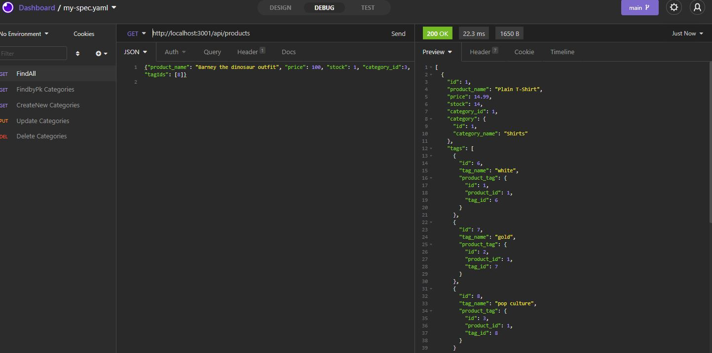
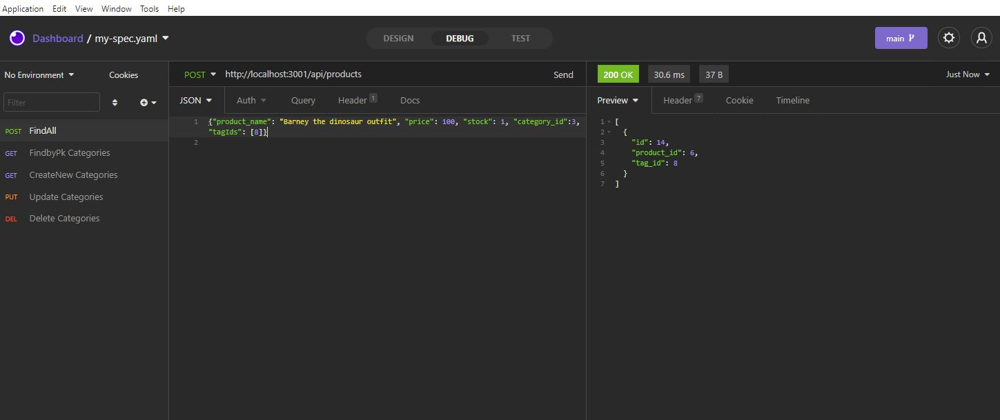

# E-Commerce-Back-End

 # Description

Demonstrating back-end functionality for an E-Commerce business. It coded to interact with a MySQL database with functionality to store, update, and delete data. Routes have been configured so only thing left to worry about is fron-end cosmetics. 

 # Table of Contents
 
 * [Installation](#installation)
 * [Useage](#useage)
 * [Contributing](#contributing)
 * [License](#license)
 * [Questions](#questions)

# Installation 

DB setup, npm i, node seeds, node server

 # Useage
 
 Demo Video:  https://drive.google.com/file/d/1pCJnLrHoHoumzZWfB516sSQXeWGOJG12/view
 
 

 

 # Contributing
 Created by Jason Bolton
 

 # License
  Licensed under MIT.
  For more information, visit this link.
  https://opensource.org/licenses/MIT
  
  
# Questions
Please feel free to contact me at jasonbolton89@gmail.com 